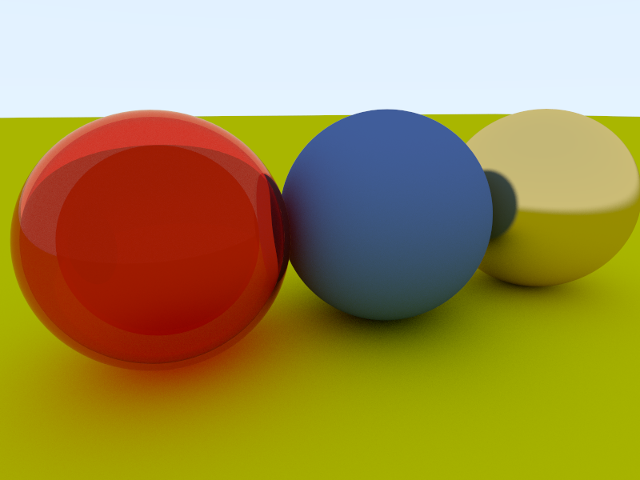
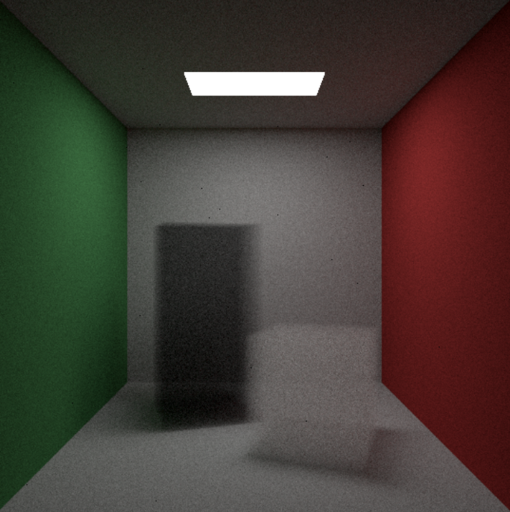
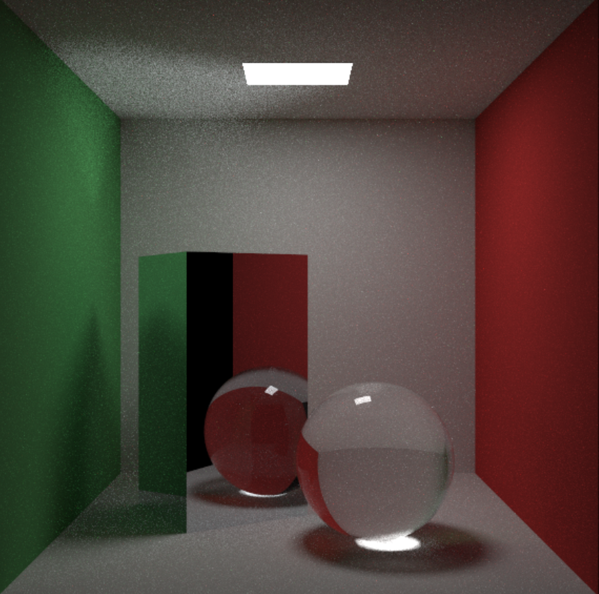
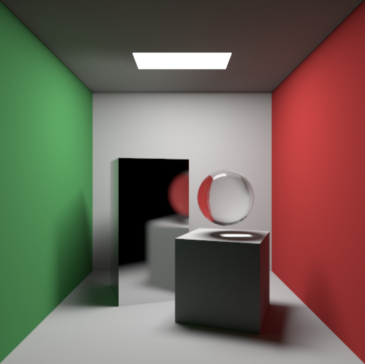

# Simple Ray Tracing Render

A simple ray tracing render in c++. This render does not rely on any external library or API.

## Feature

* Support diffuse, metal and dielectrics material
* Support Motion Blur and Defocus Blur
* Support Volumes object like smoke
* Ray tracing accelerate with Bounding Volume Hierarchies
* Using Monte Carlo Integration to estimate the flux
* Integration accelerate with importance sampling

## Gallery

dielectrics , diffuse and metal material

Volume Render

Tracing with Monte Carlo Integration and importance sampling

1000 samples per pixel

3000 samples per pixel

## Reference

[1] [Ray Tracing in One Weekend](https://raytracing.github.io/)

[2] [Physically Based Rendering: From Theory to Implementation](https://www.pbr-book.org/3ed-2018/contents)

[3] [GAMES101](https://www.bilibili.com/video/BV1X7411F744/?spm_id_from=333.999.0.0)

[4] [BVH树的构建](https://zhuanlan.zhihu.com/p/114307697)

[5] [蒙特卡洛积分](https://zhuanlan.zhihu.com/p/146144853)

[6] [brdf重要性采样](https://zhuanlan.zhihu.com/p/505284731)